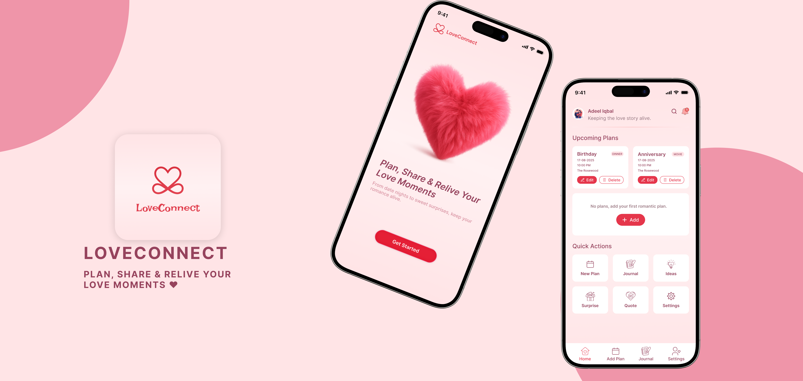

<p align="center">
  <a href="https://github.com/amarhumayunx/Love-Connect">
    
  </a>
</p>

# Love Connect 💑

**Love Connect** is a feature-rich Flutter application designed to bring couples closer together. It provides a dedicated space for couples to plan dates, share memories, and stay connected, all wrapped in a beautiful and intuitive user interface.

## ✨ Key Features

### 📅 Smart Planning
*   **Upcoming Plans**: Visual countdown and management of your next dates.
*   **Quick Add**: Easily schedule new plans with dates, times, and notes.
*   **Plan Management**: Edit, reschedule, or cancel plans with a swipe.
*   **History**: A dedicated "All Plans" view to look back on your journey.

### 💡 Inspiration Hub
*   **Date Ideas Library**: Browse a curated list of romantic date ideas (with categories and locations).
*   **"Use This Idea"**: Instantly turn an idea into a plan with one tap.
*   **Quick Actions**: Fast access to new ideas directly from the home screen.

### 🎁 The Surprise Hub
*   **Two Fun Modes**: Choose between spinning a wheel or scratching a card.
*   **🎡 Mystery Date Wheel**: Can't decide? Spin the wheel to randomly select a date idea from the library.
*   **� Lucky Love Coupons**: Interactive scratch cards that reveal cute rewards (like "Free Massage" or "Dinner on Me").

### �📖 Shared Journal
*   **Digital Diary**: Capture memories, thoughts, and "love notes".
*   **Smart Layouts**: Automatically adjusts specifically for short notes or long meaningful entries.
*   **Love Coupons Integration**: Badges show up for "Lucky Love Coupons" won from the Surprise feature.
*   **Edit & Organize**: Full control to manage your shared history.

### 🔔 Notifications & Reminders
*   **Smart Alerts**: Automated reminders for upcoming dates.
*   **Notification Center**: A dedicated screen to view current and past notifications.
*   **Daily Quotes**: Receive random romantic quotes to brighten your day.
*   **Custom Control**: Fine-tune push notifications and plan reminders in Settings.

### ⚙️ Powerful Settings & Profile
*   **Profile Customization**: View and edit your personal details and "About" section.
*   **Data Management**: Tools to clear cache or securely wipe all data if needed.
*   **Support & Feedback**: Built-in options to rate, share, and contact support.

## 🛠️ Tech Stack

Built with ❤️ using:
*   **Framework**: [Flutter](https://flutter.dev/) 🦋 (Dart)
*   **Architecture**: MVVM with [GetX](https://pub.dev/packages/get) for state management.
*   **Backend**: [Firebase](https://firebase.google.com/) 🔥 (Authentication & Realtime Database).
*   **Local Storage**: `shared_preferences` for offline data syncing.
*   **Interactive UI**: `flutter_fortune_wheel` and `scratcher` for the Surprise Hub.
*   **Notifications**: `flutter_local_notifications` for scheduled local alerts.
*   **Design**: Custom UI with `google_fonts`, `flutter_svg`, and responsive layout metrics.

## 🚀 Getting Started

1.  **Clone the repository**:
    ```bash
    git clone https://github.com/amarhumayunx/love_connect.git
    ```
2.  **Install dependencies**:
    ```bash
    flutter pub get
    ```
3.  **Run the app**:
    ```bash
    flutter run
    ```

---
*Helping hearts stay connected.* 💕
